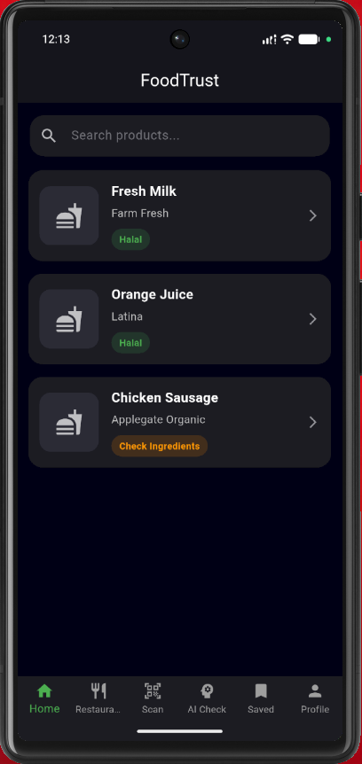
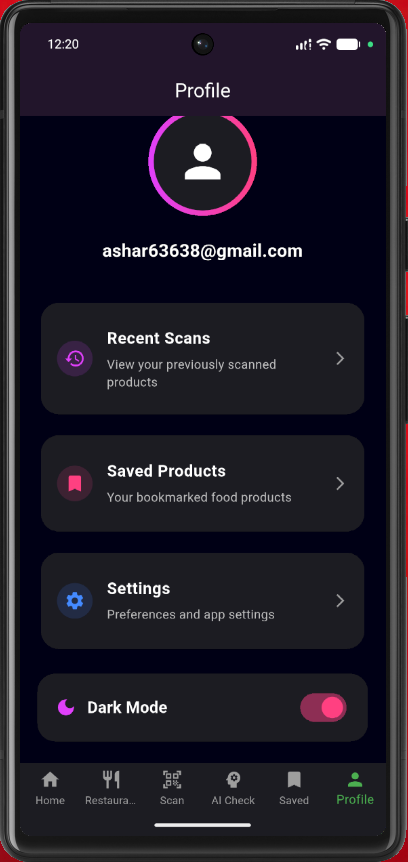
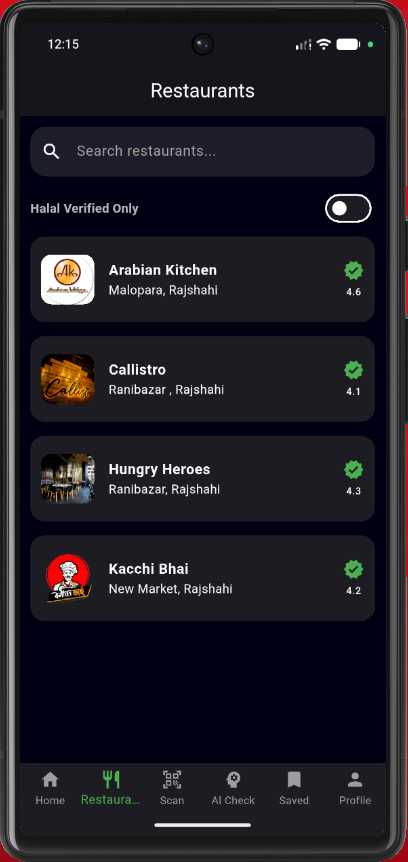

# FoodTrust – Trusted Halal Verification App

FoodTrust is a Flutter + Firebase based halal food verification platform that helps users identify halal food products, analyze ingredients, and discover trusted halal restaurants.

---

## Features

- Firebase Authentication
- Barcode Scanner
- Product Verification
- AI Ingredient Checker
- Restaurant Reviews
- Saved Products
- Scan History
- Dark / Light Theme
- Animated Splash Screen
- Firebase Firestore Backend
- Debug / Report System

---

## Technologies Used

- Flutter
- Firebase Authentication
- Cloud Firestore
- Mobile Scanner
- Provider State Management

---

## Screenshots

### Splash Screen


---

### Home Screen



---

### Profile Screen



---

### Product details Screen

![Product Details Screen] (screenshot/screenshot_details-product-screen)

---

### Restaurants


## Installation

```bash
git clone https://github.com/YOUR_USERNAME/foodtrust-app.git
cd foodtrust-app
flutter pub get
flutter run